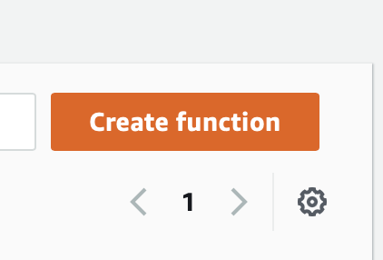
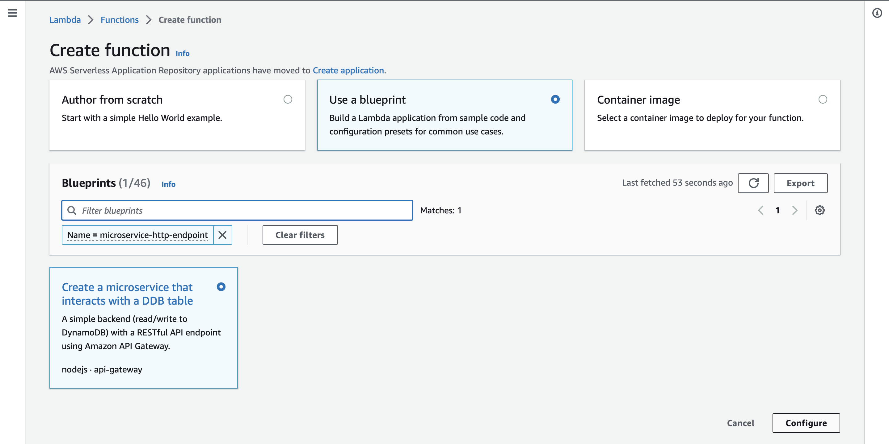
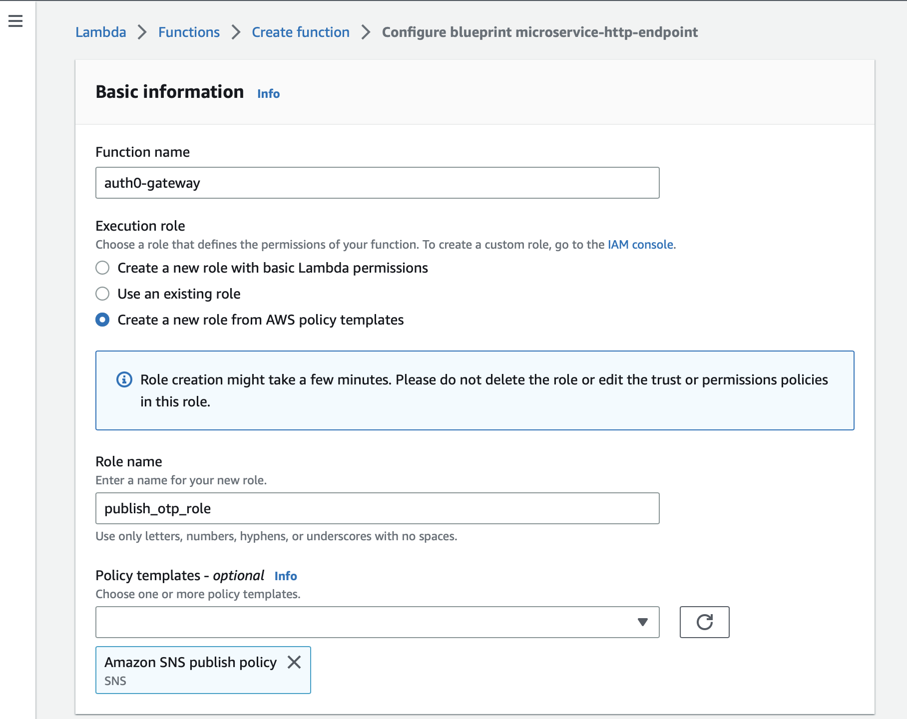
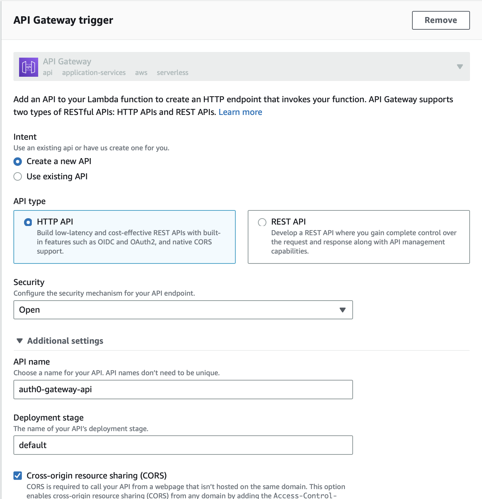
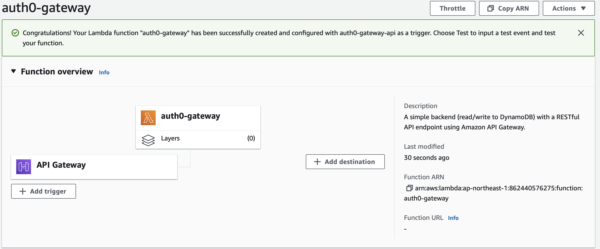
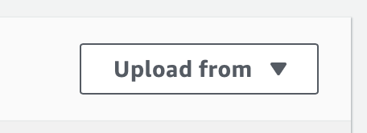
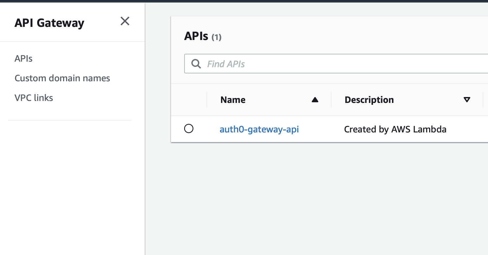
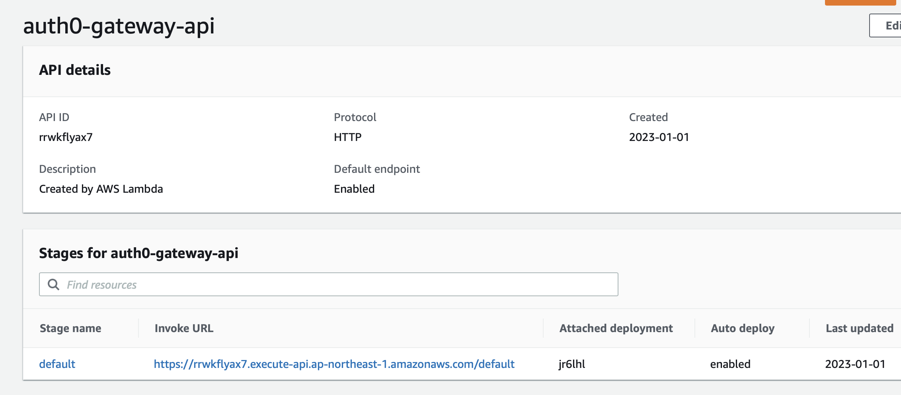

# AWS SNS instead of Twilio in Auth0
## Lambda function that can be connected with AWS API Gateway to replace Twilio from Auth0 passwordless sms connection.

## Steps to do:
1. Go to Lambda functions and press on the create function button

<br>

2. Inside create function select Use a blueprint. In the search bar, search for microservice-http-endpoint. Select it and then click Configure.

<br>

3. Inside basic information, enter a function name and under Execution role click Create a new role from AWS policy templates. Enter the Role name. The important part is to remove the Simple microservice permissions Dynamo DB and add the Amazon SNS publish policy SNS.

<br>

4. Inside the API Gateway trigger select Create an API. Select HTTP API and set the security to Open

<br>

5. Click on the Create function button to complete the creation process

<br>

6. A similar page as below will be visible

<br>

7. Upload the ```code.zip``` file in the upload from section and change the secret and any other necessary values inside the code and deploy it

<br>

8. Go API Gateway in AWS and you can find the API that was created

<br>

9. You can find the invoke URL of the API, copy it to the clipboard 

<br>

10. Refer to [this documentation by Auth0](https://auth0.com/docs/authenticate/passwordless/authentication-methods/use-sms-gateway-passwordless#authenticated-requests) and update your sms connection

```json
{
   "options":{
      "strategy":"sms",
      "provider":"sms_gateway",
      "gateway_url":"paste your gateway url here",
      "from":"+1 234 567",
      "template":"Your verification code is: @@password@@",
      "brute_force_protection":true,
      "forward_req_info":"true",
      "disable_signup":false,
      "name":"sms",
      "syntax":"md_with_macros",
      "totp":{
         "time_step":300,
         "length":6
      },
      "gateway_authentication":{
         "secret":"add your secret (256bit) here and use the same in the index.js in lambda function",
         "method":"bearer",
         "subject":"urn:Auth0",
         "audience":"urn:MySmsGateway",
         "secret":"testingtoken",
         "secret_base64_encoded":false
      }
   },
   "is_domain_connection":false,
   "enabled_clients":[],
   "realms":[
      "sms"
   ]
}
```
